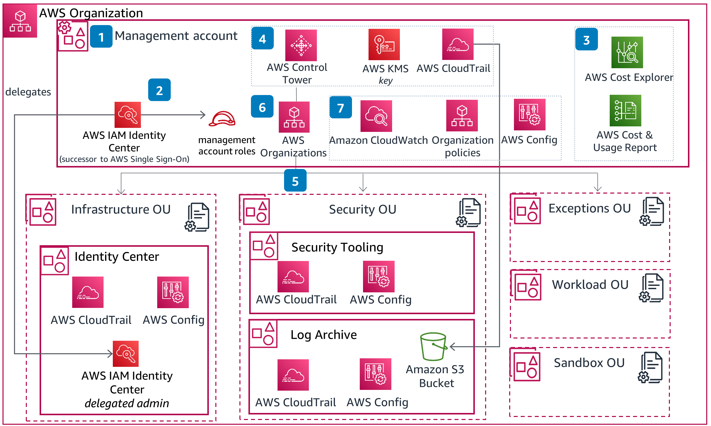

**AWS Control Tower** is an AWS-managed solution that helps you set up and govern a secure, multi-account AWS environment (a “landing zone”) using opinionated guardrails and standardized account provisioning.

## Why Control Tower (and when to use it)

Use AWS Control Tower when you need:

- A multi-account strategy with consistent governance across teams, environments, or business units
- Centralized visibility into compliance and drift (guardrails, account baselines)
- Standardized, repeatable account provisioning (Account Factory)
- A prescriptive starting point aligned to AWS security and operational best practices

Control Tower is especially valuable for:

- Enterprises adopting AWS Organizations at scale
- Regulated environments (finance, healthcare, public sector)
- Platform teams building a “paved road” for application teams

## Core concepts (mental model)

- **Organization**: The top-level container for all accounts (AWS Organizations).
- **OUs (Organizational Units)**: Logical grouping of accounts for policy application and delegation.
- **Landing Zone**: The opinionated baseline: shared accounts, network/logging/security foundations, and governance.
- **Account Factory**: Standard mechanism to provision new accounts with pre-set guardrails and baselines.
- **Guardrails**: Governance controls applied at the OU level.
    - **Preventive** guardrails: enforced via Service Control Policies (SCPs) to block prohibited actions.
    - **Detective** guardrails: implemented via AWS Config rules and reporting to detect non-compliance.

## Reference architecture (best-practice landing zone)

A commonly recommended landing zone structure uses dedicated “core” accounts plus workload accounts.

### Accounts

1. **Management account**
    - Runs AWS Organizations and Control Tower
    - Keep this account highly restricted; avoid deploying workloads here
2. **Log archive account**
    - Central destination for logs (e.g., CloudTrail, Config, S3 access logs)
    - Use immutable storage patterns (S3 Object Lock where applicable) and tight access controls
3. **Audit / Security account**
    - Security tooling and monitoring (e.g., Security Hub, GuardDuty, Detective)
    - Read-only / monitoring access into workload accounts (least privilege)

Then create **Workload accounts** (by environment and/or application):

- `prod`, `non-prod`, `dev`, `sandbox`
- or per product/team: `product-a-prod`, `product-a-dev`, etc.

### OU design

Design OUs to reflect governance boundaries:

- **Security** OU (core accounts)
- **Infrastructure / Shared services** OU
- **Workloads** OU(s): split by environment, criticality, or regulatory boundary
- **Sandbox** OU: stricter cost controls, tighter service allow-listing

Best practice: align OUs with “policy sets” and operational ownership. Avoid deeply nested OUs unless there’s a clear governance requirement.

## Networking architecture patterns

Control Tower itself does not force one network model, but your landing zone should standardize one.

Common patterns:

- **Centralized shared networking**: A dedicated “network” or “shared services” account owns VPCs, Transit Gateway, egress, and shared endpoints.
- **Distributed VPCs per workload account**: Each workload account owns its VPCs; connectivity is standardized via Transit Gateway and shared DNS.

Best-practice elements:

- Use **AWS Transit Gateway** for scalable hub-and-spoke connectivity across accounts.
- Prefer **VPC endpoints / PrivateLink** to reduce exposure to the public internet.
- Centralize **egress** with inspection (e.g., network firewall) if your threat model requires it.
- Standardize DNS with Route 53 Resolver rules and shared hosted zones where appropriate.

## Identity & access (least privilege by design)

### IAM Identity Center (recommended)

- Use **IAM Identity Center** (formerly AWS SSO) as the default human access pattern.
- Integrate with an external IdP (e.g., Azure AD/Okta) where possible.
- Assign access using **permission sets** mapped to groups (not individuals).

### Delegated administration

Use delegated admin for security and operations services to avoid running everything in the management account:

- Security Hub, GuardDuty, Detective
- AWS Config / Conformance Packs (where appropriate)
- (Optional) centralized incident response tooling

### Break-glass access

- Maintain a minimal, monitored break-glass role with MFA and strong controls.
- Keep access paths documented and tested.

## Guardrails strategy (governance that scales)

### Start with guardrails that prevent high-risk actions

Examples of preventive guardrails to consider early:

- Disallow disabling CloudTrail / Config
- Disallow changing log archive bucket policies
- Disallow public S3 bucket policies (with exceptions tightly controlled)

### Add detective guardrails for continuous compliance

- Use AWS Config + conformance packs to evaluate resource configuration
- Feed findings into Security Hub and an operations workflow (ticketing/alerts)

Best practice: treat guardrails as code where possible (policy-as-code, version control, change management), and use OUs to apply them consistently.

## Logging, monitoring, and security operations

### Logging baseline

- Enable **organization-wide CloudTrail** and deliver to the Log archive account.
- Centralize **AWS Config** records and snapshots.
- Standardize log retention and access patterns.
- Encrypt logs with **KMS** keys managed in the Log archive account, with tightly scoped key policies.

### Threat detection & posture management

- Enable **GuardDuty** across all accounts and regions required.
- Enable **Security Hub** with appropriate standards (e.g., CIS, AWS Foundational Security Best Practices).
- Use **Amazon Detective** for investigations where helpful.
- Integrate alerts to an on-call process (email/ChatOps/SIEM).

## Account lifecycle: the paved-road workflow

A best-practice workflow for new accounts:

1. Request intake (team, purpose, environment, data classification)
2. Provision via **Account Factory** with standard baseline
3. Attach to the right OU (inherit guardrails and policies)
4. Bootstrap workload account:
    - baseline IAM roles, logging, tagging enforcement
    - network attachment (Transit Gateway, shared DNS, endpoints)
    - security tooling enrollment
5. Continuous validation (drift detection, config compliance, periodic access reviews)

## Operational best practices

- **Standardize regions**: define allowed regions; enforce via SCPs where appropriate.
- **Tagging strategy**: mandate tags for cost allocation, ownership, and classification.
- **Cost controls**: budgets, anomaly detection, and sandbox restrictions.
- **Change management**: treat landing zone changes as high-impact; use staged rollout (dev OU → prod OU).
- **Drift management**: monitor for guardrail non-compliance and remediate through automation.

## Common pitfalls (and how to avoid them)

- **Using the management account for workloads**
    - Keep it clean and locked down; use workload accounts for everything else.
- **Overly complex OU hierarchy**
    - Design OUs around governance, not org charts.
- **Weak identity hygiene**
    - Use Identity Center, MFA, and group-based access; minimize long-lived access keys.
- **Ignoring operations**
    - Guardrails are not the same as operational readiness; invest in monitoring, incident response, and patching processes.

## Putting it all together: an opinionated reference blueprint

A practical blueprint many teams adopt:

- Core accounts: `management`, `log-archive`, `security/audit`, (optional) `shared-services`, `network`
- OUs: `Security`, `Shared-Services`, `Workloads-Prod`, `Workloads-NonProd`, `Sandbox`
- Mandatory org services: CloudTrail, Config, Security Hub, GuardDuty
- Connectivity: Transit Gateway + standardized VPC patterns + endpoints
- Governance: preventive SCPs + detective Config rules + Security Hub aggregation
- Provisioning: Account Factory + standardized baseline + automation for bootstrap

## Closing thoughts

AWS Control Tower accelerates a secure multi-account foundation by giving you a managed landing zone, built-in governance guardrails, and standardized account provisioning. The key to long-term success is combining Control Tower’s governance model with a clear OU/account strategy, a standardized network pattern, and strong identity + logging baselines—then operating it as a product that evolves with your organization.