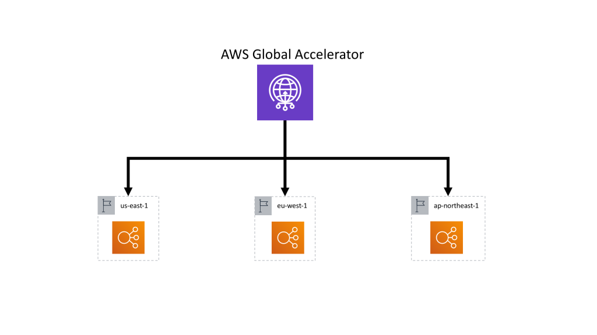

# AWS Global Accelerator

## Overview

AWS Global Accelerator (GA) is a global anycast edge service that provides static IP addresses and steers user traffic to the closest healthy AWS endpoint over the AWS global network. GA improves availability (fast failover), performance (reduced latency/jitter), and operational simplicity (stable entry points).

## When to use (and when not to)

- Use GA when you need:
    - Multi-Region active/active or active/passive with fast failover
    - Static IPv4 addresses (and optionally IPv6) for allowlists and stable DNS targets
    - Better performance vs Internet-based routing to regional endpoints
    - Built-in health checks and traffic dials (weights) across endpoints/Regions
- Prefer Route 53 alone when:
    - You only need DNS-based routing without static IPs
    - You can tolerate DNS TTL-based failover timing
- Prefer CloudFront when:
    - You need caching, WAF at edge, and content delivery optimizations
    - Your main goal is accelerating static/dynamic content via CDN (you can combine CloudFront + GA in some designs, but it’s not the default)

## Reference architecture (high level)

1. Clients resolve a DNS name (e.g., [app.example.com](http://app.example.com)) to GA’s static anycast IPs (A/AAAA records).
2. Traffic enters the closest GA edge location.
3. GA routes over the AWS global network to the optimal healthy endpoint based on:
    - Proximity to end user
    - Endpoint health
    - Routing configuration (traffic dial, endpoint weights)
4. Endpoints can be:
    - Application Load Balancer (ALB)
    - Network Load Balancer (NLB)
    - Elastic IP (EIP) (for EC2 / NAT / appliances)
    - (and other supported endpoint types as applicable)

## Design goals

- Minimize user-perceived latency globally
- Provide deterministic, fast failover across AZs and Regions
- Keep entry points stable (static IPs) for:
    - Firewall allowlisting
    - Legacy clients that can’t handle DNS changes well
- Preserve least privilege and strong network segmentation
- Provide clear observability and operational runbooks

## Core components

### Accelerator

- Provides 2 static IPv4 addresses by default (optionally IPv6).
- Choose accelerator type:
    - Standard accelerator: general-purpose anycast acceleration + routing
    - Custom routing accelerator: for specific port/IP mapping use cases (advanced)

### Listeners

- Define protocol and port(s) clients use (TCP/UDP).
- Recommended:
    - Keep listener ports minimal and aligned to your app (e.g., 443/TCP).
    - Separate listeners when you want independent routing behavior/ports (e.g., 443 vs 8443).

### Endpoint groups (per AWS Region)

- One endpoint group per Region you want to serve.
- Health check settings at the group level influence failover behavior.
- Recommended:
    - Use at least two Regions for high availability (when business requirements demand).
    - Set traffic dial (0–100%) for controlled rollouts and Region evacuation.

### Endpoints

- Attach your ALB/NLB/EIP as endpoints inside the endpoint group.
- Use weights for:
    - Canary rollouts
    - Gradual shift between stacks in the same Region

## Availability & resilience best practices

- Multi-AZ in each Region:
    - Use ALB/NLB spanning at least two AZs.
    - Ensure targets (ECS/EKS/EC2) are spread across AZs.
- Multi-Region:
    - Active/active: split traffic (e.g., 50/50) or based on business needs.
    - Active/passive: primary at 100%, secondary at 0% (ready for emergency failover).
- Health checks:
    - Ensure the health check path represents true application health (not just “port open”).
    - Avoid over-sensitive health checks that flap during deployments.
- Controlled failover:
    - Use traffic dial to drain a Region gracefully for maintenance.
    - Keep a documented “Region evacuation” procedure (what to change, in what order, and verification steps).

## Networking & security architecture

### Edge to origin path

- GA terminates at the AWS edge and forwards to endpoints.
- Choose ALB vs NLB:
    - ALB: L7 routing, TLS termination, HTTP/2, path-based routing
    - NLB: ultra-low latency, static IP per AZ, TCP/UDP, preserves source IP in many scenarios

### TLS and certificates

- Recommended patterns:
    - Terminate TLS at ALB (ACM certificate) for HTTP/HTTPS applications.
    - For end-to-end encryption, re-encrypt from ALB to targets (or terminate on targets).
- Prefer TLS 1.2+ and modern cipher suites.
- If mutual TLS is required, consider NLB with TLS listeners or application-level mTLS depending on the stack.

### Source IP considerations

- Plan for how your app uses client IP:
    - With ALB, use X-Forwarded-For for client IP at L7.
    - With NLB, client IP can be preserved at L4 depending on configuration.
- Confirm logging and WAF/IP allowlists based on the correct IP signal.

### Security controls

- Use least privilege IAM for GA administration:
    - Separate roles for read-only, operations, and break-glass.
- Network segmentation:
    - Public-facing ALB in public subnets only if needed; keep targets in private subnets.
    - Use security groups and NACLs to restrict inbound to only required ports.
- DDoS protection:
    - GA integrates with AWS Shield (use AWS Shield Advanced for enhanced protection if risk warrants).
- WAF:
    - GA itself is not where WAF rules run; attach AWS WAF to CloudFront or ALB (for HTTP/S) depending on your architecture.

## Routing, deployment, and traffic management

- Blue/green deployments (per Region):
    - Two target groups behind ALB (blue and green) and shift weights at endpoint or ALB level.
- Progressive delivery (multi-Region):
    - Start with secondary Region at 0–5% traffic dial, validate, then increase.
- Disaster recovery:
    - Define RTO/RPO targets.
    - Active/passive: keep passive Region warmed (data replicated, capacity ready).

## Observability & operations

### Metrics (CloudWatch)

Monitor at minimum:

- Endpoint health status and health check failures
- Traffic volume by listener/endpoint group
- Failover events and routing changes

### Logging

- ALB/NLB access logs to S3 for audit and analytics.
- Application logs centralized (CloudWatch Logs / OpenSearch / SIEM).
- Consider VPC Flow Logs for network forensics.

### Runbooks

Include:

- Planned maintenance: reduce traffic dial, validate, restore.
- Unplanned incident: verify health signals, shift traffic, communicate.
- Certificate rotation (if terminating TLS at ALB/NLB/targets).
- Endpoint replacement (e.g., NLB migration, ALB recreation).

## Cost considerations

- GA pricing is based on:
    - Accelerator-hours
    - Data transfer through GA
- Optimize by:
    - Using GA only for latency-sensitive or HA-critical entry points
    - Sending bulk/static content through CloudFront caching where appropriate

## Common patterns

### Pattern A: Global web app (HTTP/S)

- GA → ALB (per Region) → ECS/EKS/EC2 in private subnets
- AWS WAF attached to ALB (or CloudFront if you introduce CDN)
- Route 53 points [app.example.com](http://app.example.com) to GA static IPs

### Pattern B: Global TCP/UDP service

- GA → NLB (per Region) → service targets
- Use NLB for L4 protocols and predictable performance

### Pattern C: Static IP for allowlisting

- Use GA static IPs as the only allowlisted public ingress in partner networks.
- Keep backend endpoints changeable without partner updates.

## Implementation checklist

- [ ]  Define required ports/protocols and create listeners.
- [ ]  Choose Regions and create one endpoint group per Region.
- [ ]  Attach endpoints (ALB/NLB/EIP) with weights.
- [ ]  Configure health checks aligned to application readiness.
- [ ]  Set initial traffic dial strategy (canary or primary-only).
- [ ]  Configure DNS to GA static IPs.
- [ ]  Validate failover: simulate endpoint failure and measure recovery time.
- [ ]  Add dashboards/alarms and document runbooks.

## Key decisions (fill in)

- Regions: [Primary], [Secondary], …
- Accelerator type: Standard / Custom routing
- Listener ports: [e.g., 443/TCP]
- Endpoint types: ALB / NLB / EIP
- Health check path: [/healthz] and expected response
- Traffic policy: active/active (weights) or active/passive (dial)

## Pitfalls to avoid

- Using shallow health checks that don’t reflect real user impact
- Forgetting multi-AZ target distribution (Regional endpoint is not enough)
- Overly tight firewall rules that break GA-to-endpoint connectivity
- Relying on DNS failover timing when you actually need sub-minute failover (use GA)