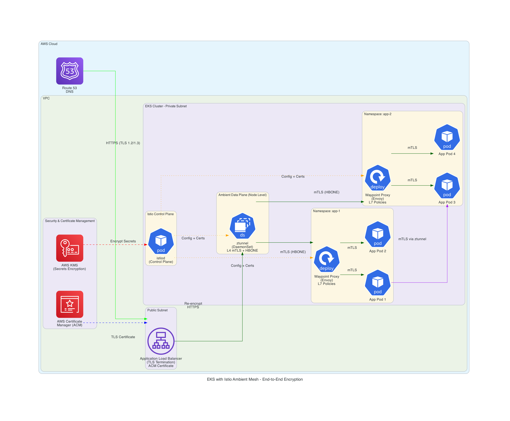

+++
title = 'End-to-End Encryption Architecture for AWS EKS with Istio Ambient Mesh'
date = 2026-03-13T20:41:12+05:30
draft = false
+++


## Architecture Overview

This architecture implements comprehensive end-to-end encryption for applications running on Amazon EKS using Istio Ambient Mesh, following AWS best practices for security and compliance.

### Key Components

1. **AWS Application Load Balancer (ALB)** - TLS termination at edge with ACM certificates
2. **AWS Certificate Manager (ACM)** - Automated certificate lifecycle management
3. **Istio Ambient Mesh** - Sidecar-less service mesh with layered security
4. **ztunnel** - Node-level L4 proxy providing mTLS and zero-trust networking
5. **Waypoint Proxies** - Optional L7 Envoy proxies for advanced traffic management
6. **AWS KMS** - Encryption of Kubernetes secrets at rest

## Architecture Diagram



## Encryption Layers

### Layer 1: Internet to ALB (North-South Traffic)
- **Protocol**: HTTPS with TLS 1.2/1.3
- **Certificate**: ACM-managed public certificate
- **Termination**: ALB terminates TLS and validates client requests
- **Best Practice**: Use ACM for automatic certificate renewal and AWS-managed security

### Layer 2: ALB to EKS Cluster
- **Protocol**: Re-encrypted HTTPS or mTLS
- **Options**:
  - **Option A**: ALB re-encrypts traffic to backend targets (recommended)
  - **Option B**: ALB passes through encrypted traffic to ztunnel
- **Certificate**: ACM Private CA or self-signed certificates for backend encryption

### Layer 3: ztunnel Layer (L4 Secure Overlay)
- **Protocol**: HBONE (HTTP-Based Overlay Network Environment)
- **Encryption**: Automatic mTLS between all mesh workloads
- **Deployment**: DaemonSet on every node
- **Features**:
  - Zero-trust tunnel for all pod traffic
  - L4 authorization policies
  - Transparent traffic capture and encryption
  - No application changes required

### Layer 4: Waypoint Proxies (L7 Processing)
- **Protocol**: mTLS with full L7 capabilities
- **Deployment**: Per-namespace or per-service account
- **Features**:
  - Advanced traffic routing (VirtualService, DestinationRule)
  - L7 authorization policies
  - Request/response manipulation
  - Circuit breaking and retries

### Layer 5: Pod-to-Pod (East-West Traffic)
- **Protocol**: mTLS via ztunnel
- **Encryption**: All inter-pod communication encrypted by default
- **Identity**: SPIFFE-based workload identity
- **Zero Trust**: Deny-by-default with explicit authorization policies

### Layer 6: Data at Rest
- **EKS Secrets**: Encrypted using AWS KMS customer-managed keys
- **etcd**: Envelope encryption with KMS
- **EBS Volumes**: Encrypted with KMS keys
- **Best Practice**: Use separate KMS keys for different data classifications

---

## Implementation Guide

### Prerequisites

```bash
# Required tools
- AWS CLI v2
- kubectl v1.28+
- helm v3.12+
- istioctl v1.28+
```

### Step 1: Create EKS Cluster with Encryption

```bash
# Create KMS key for EKS secrets encryption
aws kms create-key \
  --description "EKS secrets encryption key" \
  --region us-east-1

# Create key alias
aws kms create-alias \
  --alias-name alias/eks-secrets \
  --target-key-id <key-id>

# Create EKS cluster with encryption enabled
eksctl create cluster \
  --name istio-ambient-cluster \
  --region us-east-1 \
  --version 1.28 \
  --nodegroup-name standard-workers \
  --node-type t3.large \
  --nodes 3 \
  --nodes-min 3 \
  --nodes-max 6 \
  --encryption-config-key-arn arn:aws:kms:us-east-1:ACCOUNT_ID:key/KEY_ID \
  --managed
```

### Step 2: Install Istio Ambient Mesh

```bash
# Download Istio
curl -L https://istio.io/downloadIstio | ISTIO_VERSION=1.28.3 sh -
cd istio-1.28.3
export PATH=$PWD/bin:$PATH

# Install Istio with ambient profile
istioctl install --set profile=ambient -y

# Verify installation
kubectl get pods -n istio-system
```

Expected output:
```
NAME                      READY   STATUS    RESTARTS   AGE
istiod-xxx                1/1     Running   0          2m
ztunnel-xxx               1/1     Running   0          2m
ztunnel-yyy               1/1     Running   0          2m
ztunnel-zzz               1/1     Running   0          2m
```

### Step 3: Configure ACM Certificate for ALB

```bash
# Request public certificate from ACM
aws acm request-certificate \
  --domain-name "*.example.com" \
  --subject-alternative-names "example.com" \
  --validation-method DNS \
  --region us-east-1

# Note the certificate ARN for ALB configuration
```

### Step 4: Deploy AWS Load Balancer Controller

```bash
# Create IAM policy for Load Balancer Controller
curl -o iam-policy.json https://raw.githubusercontent.com/kubernetes-sigs/aws-load-balancer-controller/main/docs/install/iam_policy.json

aws iam create-policy \
  --policy-name AWSLoadBalancerControllerIAMPolicy \
  --policy-document file://iam-policy.json

# Create service account
eksctl create iamserviceaccount \
  --cluster=istio-ambient-cluster \
  --namespace=kube-system \
  --name=aws-load-balancer-controller \
  --attach-policy-arn=arn:aws:iam::ACCOUNT_ID:policy/AWSLoadBalancerControllerIAMPolicy \
  --approve

# Install Load Balancer Controller
helm repo add eks https://aws.github.io/eks-charts
helm repo update

helm install aws-load-balancer-controller eks/aws-load-balancer-controller \
  -n kube-system \
  --set clusterName=istio-ambient-cluster \
  --set serviceAccount.create=false \
  --set serviceAccount.name=aws-load-balancer-controller
```

### Step 5: Enable Ambient Mesh for Namespace

```bash
# Create application namespace
kubectl create namespace app-1

# Enable ambient mesh
kubectl label namespace app-1 istio.io/dataplane-mode=ambient

# Verify ztunnel is capturing traffic
kubectl get pods -n app-1 -o jsonpath='{.items[*].metadata.annotations.ambient\.istio\.io/redirection}'
```

### Step 6: Deploy Waypoint Proxy (Optional - for L7 features)

```bash
# Deploy waypoint proxy for namespace
istioctl x waypoint apply -n app-1

# Verify waypoint deployment
kubectl get pods -n app-1 -l gateway.istio.io/managed=istio.io-mesh-controller

# Label namespace to use waypoint
kubectl label namespace app-1 istio.io/use-waypoint=waypoint
```

### Step 7: Deploy Sample Application with ALB Ingress

```yaml
# app-deployment.yaml
apiVersion: apps/v1
kind: Deployment
metadata:
  name: sample-app
  namespace: app-1
spec:
  replicas: 3
  selector:
    matchLabels:
      app: sample-app
  template:
    metadata:
      labels:
        app: sample-app
    spec:
      containers:
      - name: app
        image: nginx:latest
        ports:
        - containerPort: 80
---
apiVersion: v1
kind: Service
metadata:
  name: sample-app
  namespace: app-1
spec:
  selector:
    app: sample-app
  ports:
  - port: 80
    targetPort: 80
  type: ClusterIP
---
apiVersion: networking.k8s.io/v1
kind: Ingress
metadata:
  name: sample-app-ingress
  namespace: app-1
  annotations:
    alb.ingress.kubernetes.io/scheme: internet-facing
    alb.ingress.kubernetes.io/target-type: ip
    alb.ingress.kubernetes.io/certificate-arn: arn:aws:acm:us-east-1:ACCOUNT_ID:certificate/CERT_ID
    alb.ingress.kubernetes.io/listen-ports: '[{"HTTPS":443}]'
    alb.ingress.kubernetes.io/ssl-policy: ELBSecurityPolicy-TLS13-1-2-2021-06
    alb.ingress.kubernetes.io/backend-protocol: HTTPS
    alb.ingress.kubernetes.io/healthcheck-protocol: HTTPS
spec:
  ingressClassName: alb
  rules:
  - host: app.example.com
    http:
      paths:
      - path: /
        pathType: Prefix
        backend:
          service:
            name: sample-app
            port:
              number: 80
```

```bash
kubectl apply -f app-deployment.yaml
```

### Step 8: Configure mTLS Policies

```yaml
# peer-authentication.yaml
apiVersion: security.istio.io/v1beta1
kind: PeerAuthentication
metadata:
  name: default
  namespace: app-1
spec:
  mtls:
    mode: STRICT
---
# authorization-policy.yaml
apiVersion: security.istio.io/v1beta1
kind: AuthorizationPolicy
metadata:
  name: allow-ingress
  namespace: app-1
spec:
  action: ALLOW
  rules:
  - from:
    - source:
        principals: ["cluster.local/ns/istio-system/sa/ztunnel"]
    to:
    - operation:
        methods: ["GET", "POST"]
```

```bash
kubectl apply -f peer-authentication.yaml
kubectl apply -f authorization-policy.yaml
```

### Step 9: Verify End-to-End Encryption

```bash
# Check ztunnel logs for mTLS connections
kubectl logs -n istio-system -l app=ztunnel --tail=50

# Verify mTLS is enabled
istioctl x describe pod <pod-name> -n app-1

# Test connectivity
kubectl exec -n app-1 <pod-name> -- curl -v https://sample-app.app-1.svc.cluster.local
```

### Step 10: Enable Network Policies (Defense in Depth)

```yaml
# network-policy.yaml
apiVersion: networking.k8s.io/v1
kind: NetworkPolicy
metadata:
  name: default-deny-all
  namespace: app-1
spec:
  podSelector: {}
  policyTypes:
  - Ingress
  - Egress
---
apiVersion: networking.k8s.io/v1
kind: NetworkPolicy
metadata:
  name: allow-dns
  namespace: app-1
spec:
  podSelector: {}
  policyTypes:
  - Egress
  egress:
  - to:
    - namespaceSelector:
        matchLabels:
          kubernetes.io/metadata.name: kube-system
    ports:
    - protocol: UDP
      port: 53
---
apiVersion: networking.k8s.io/v1
kind: NetworkPolicy
metadata:
  name: allow-app-traffic
  namespace: app-1
spec:
  podSelector:
    matchLabels:
      app: sample-app
  policyTypes:
  - Ingress
  ingress:
  - from:
    - namespaceSelector:
        matchLabels:
          kubernetes.io/metadata.name: istio-system
    ports:
    - protocol: TCP
      port: 80
```

```bash
# Enable VPC CNI network policy support
kubectl set env daemonset aws-node -n kube-system ENABLE_NETWORK_POLICY=true

kubectl apply -f network-policy.yaml
```

---

## Security Best Practices

### 1. Certificate Management
- Use ACM for public-facing certificates (automatic renewal)
- Use ACM Private CA for internal service-to-service certificates
- Rotate certificates before expiration
- Monitor certificate expiration with CloudWatch alarms

### 2. KMS Key Management
- Use separate KMS keys for different security domains
- Enable automatic key rotation
- Implement least-privilege IAM policies for key access
- Enable CloudTrail logging for key usage

### 3. Network Security
- Deploy EKS in private subnets
- Use security groups to restrict ALB access
- Enable VPC Flow Logs for traffic analysis
- Implement network policies for defense in depth

### 4. Istio Security
- Enable STRICT mTLS mode for all namespaces
- Implement authorization policies (deny-by-default)
- Use separate waypoint proxies per namespace for isolation
- Regularly update Istio to latest stable version

### 5. Monitoring and Observability
- Enable Istio telemetry for traffic metrics
- Configure CloudWatch Container Insights
- Set up alerts for certificate expiration
- Monitor ztunnel and waypoint proxy health

### 6. Compliance
- Enable audit logging for EKS control plane
- Use AWS Config rules for compliance checking
- Implement pod security standards
- Regular security assessments and penetration testing

---

## Traffic Flow Details

### Ingress Traffic (North-South)

1. **Client → Route 53**: DNS resolution to ALB endpoint
2. **Client → ALB**: TLS 1.3 handshake with ACM certificate
3. **ALB → ztunnel**: Re-encrypted HTTPS or mTLS connection
4. **ztunnel → Waypoint**: HBONE tunnel with mTLS
5. **Waypoint → Pod**: mTLS connection with L7 policy enforcement
6. **Pod**: Application processes request

### East-West Traffic (Pod-to-Pod)

1. **Source Pod**: Initiates connection to destination service
2. **ztunnel (source node)**: Intercepts traffic, establishes mTLS
3. **HBONE Tunnel**: Encrypted tunnel across nodes
4. **ztunnel (dest node)**: Terminates tunnel, forwards to waypoint
5. **Waypoint**: Applies L7 policies, routes to destination
6. **Destination Pod**: Receives encrypted request

### Certificate Flow

1. **istiod**: Acts as Certificate Authority (CA)
2. **ztunnel**: Requests certificates from istiod
3. **Waypoint**: Requests certificates from istiod
4. **Workloads**: Receive SPIFFE identities
5. **Rotation**: Automatic certificate rotation (default: 24h lifetime)

---

## Monitoring and Troubleshooting

### Verify mTLS is Working

```bash
# Check if ambient is enabled
kubectl get namespace app-1 -o jsonpath='{.metadata.labels.istio\.io/dataplane-mode}'

# Verify ztunnel is running
kubectl get daemonset -n istio-system ztunnel

# Check mTLS status
istioctl x describe pod <pod-name> -n app-1 | grep -i mtls

# View ztunnel logs
kubectl logs -n istio-system -l app=ztunnel -f
```

### Common Issues

**Issue**: Pods not receiving traffic
```bash
# Check if namespace is labeled for ambient
kubectl get namespace app-1 --show-labels

# Verify ztunnel is capturing traffic
kubectl get pods -n app-1 -o yaml | grep ambient.istio.io/redirection
```

**Issue**: Certificate errors
```bash
# Check istiod logs
kubectl logs -n istio-system -l app=istiod

# Verify certificate chain
istioctl proxy-config secret <pod-name> -n app-1
```

**Issue**: ALB health checks failing
```bash
# Ensure backend protocol is set correctly
kubectl get ingress -n app-1 -o yaml | grep backend-protocol

# Check target group health
aws elbv2 describe-target-health --target-group-arn <tg-arn>
```

---

## Performance Considerations

### ztunnel Performance
- Written in Rust for high performance and low memory footprint
- Handles L4 traffic with minimal latency overhead (<1ms)
- Scales horizontally with node count (DaemonSet)

### Waypoint Performance
- Only deployed when L7 features are needed
- Can be scaled independently based on traffic
- Use HPA for automatic scaling

### ALB Optimization
- Use target type `ip` for direct pod routing
- Enable connection draining for graceful shutdowns
- Configure appropriate health check intervals

---

## Cost Optimization

1. **Selective Waypoint Deployment**: Only deploy waypoints for namespaces requiring L7 features
2. **ALB Sharing**: Use single ALB with host-based routing for multiple applications
3. **KMS Key Reuse**: Share KMS keys across similar security domains
4. **Right-sizing**: Monitor and adjust waypoint proxy resources based on actual usage

---

## Migration Strategy

### From Sidecar to Ambient

1. Install Istio with ambient support
2. Keep existing sidecar workloads running
3. Gradually migrate namespaces to ambient mode
4. Remove sidecar injection labels
5. Verify traffic flow and policies
6. Decommission sidecar infrastructure

### From No Mesh to Ambient

1. Start with ztunnel only (L4 encryption)
2. Validate mTLS is working
3. Add waypoint proxies for namespaces needing L7 features
4. Incrementally add authorization policies
5. Enable STRICT mTLS mode

---

## References

- [AWS EKS Best Practices - Network Security](https://docs.aws.amazon.com/eks/latest/best-practices/network-security.html)
- [AWS EKS Encryption Best Practices](https://docs.aws.amazon.com/prescriptive-guidance/latest/encryption-best-practices/eks.html)
- [Istio Ambient Mesh Documentation](https://istio.io/latest/docs/ambient/overview/)
- [AWS Certificate Manager Integration](https://docs.aws.amazon.com/acm/latest/userguide/acm-services.html)
- [AWS Load Balancer Controller](https://kubernetes-sigs.github.io/aws-load-balancer-controller/)

---

## Conclusion

This architecture provides comprehensive end-to-end encryption for EKS workloads using Istio Ambient Mesh, following AWS best practices:

✅ **TLS termination at ALB** with ACM-managed certificates  
✅ **Re-encryption** from ALB to cluster  
✅ **Automatic mTLS** for all pod-to-pod traffic via ztunnel  
✅ **L7 security policies** via waypoint proxies  
✅ **Secrets encryption at rest** with AWS KMS  
✅ **Zero-trust networking** with deny-by-default policies  
✅ **No application changes** required (sidecar-less)  
✅ **Incremental adoption** with layered security model  

The ambient mesh architecture provides a more efficient and operationally simpler approach compared to traditional sidecar-based service meshes, while maintaining the same security guarantees.